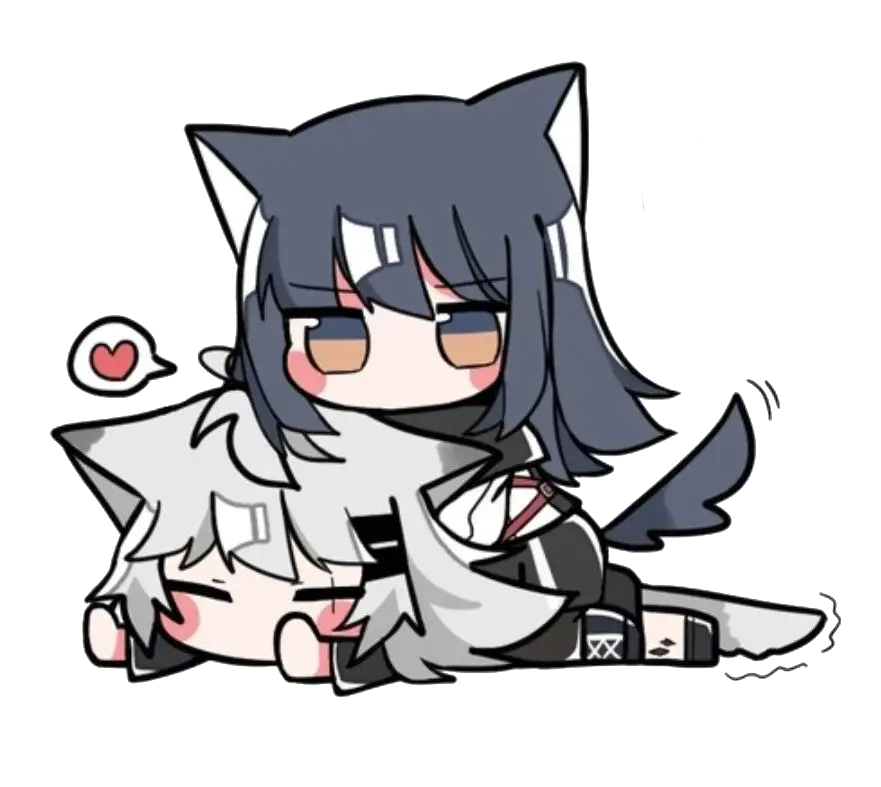

## Hey, Untrustnova in here👋!

A small independent community of developers, designers, and engineers come together to build meaningful digital products.  

💡 *Started as a side project. Evolved into something more.*  
What began as a collective of curious developers has grown into a creative technology company focused on building reliable, human-centered software.  
We work at the intersection of design, engineering, and curiosity - turning small ideas into tools that empower people and communities.  

We don’t chase perfection or trends. We chase learning — the kind that happens when you break something, fix it, and accidentally make it better. Every project here is a reflection of what we love: simple tools, weird experiments, and the thrill of making something work.  
